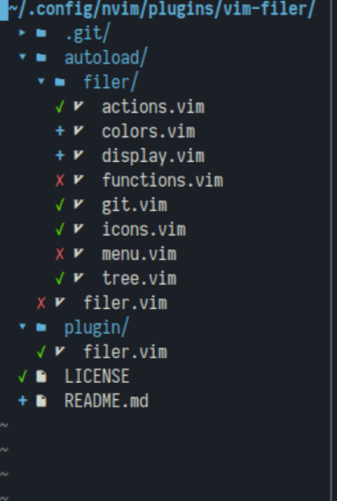

# Filer
A faster nerdtree with built in icons and git commands\
\
To open filer:\
`FilerOpen`

To close filer:\
`FilerClose`

To toggle filer being open:\
`FilerToggle`

## Navigation Shortcuts
* `?`: Show a list of shortcuts within the plugin
* `Space`: Toggle a directory being open
* `Enter`: Navigate into a directory, or open a file
* `x`: Open a file using the default program (using `xdg-open`)
* `r`: Reload the file tree
* `u`: Navigate to the parent of the current directory
* `l` / `h`: Open/close the current directory and jump in/out of it
* `L` / `H`: Set the pwd to be a directory higher/lower
* `t`: Open the navigation menu (go **T**o a certain directory)
	* `~`: Go to the home directory
	* `/`: Go to the root directory
## File management shortcuts
* `i`: Show the metadata of a file or directory
* `f`: Open the file editting menu
	* `m`: Move the file
	* `c`: Copy the file
	* `l`: Create a link to the file
	* `r`: Rename the file
	* `x`: Toggle the file being executable
	* `d`: Delete the file
* `v`: Open the git command menu (v for version control)
	* `a`: Git add the file
	* `l`: Show the git log history
	* `c`: Create a new commit
	* `m`: Ammend the previous commit
* `a`: Open the add menu
	* `f`: Add a new empty file
	* `d`: Add a new empty directory

## Customization
These customizations must occur after filer is loaded in your config, otherwise they will be overwritten.

Set the icon type to either 'filled' or 'outline' for the different types of nerdfont icons,\
or to 'unicode' or 'text' if you don't have nerdfont installed, or are using a tty.\
`let g:filer#icon_type = 'filled' / 'outline' / 'unicode' / 'text'`

Change how much each nested directory is indented.\
`let g:filer#indent_amount = 2`

Highlight the current file, like ranger, instead of just showing the cursor.\
`let g:filer#enable_highlight = 1`

Change the name of the filer buffer.\
`let g:filer#buffer_name = "Whatever you want"`

Make filer open on the right side instead of the left.\
`let g:filer#buffer_position = 'right'`

Set the width of the filer window when it opens.\
`let g:filer#buffer_size = 35`

## Screenshots

